<div align="center">

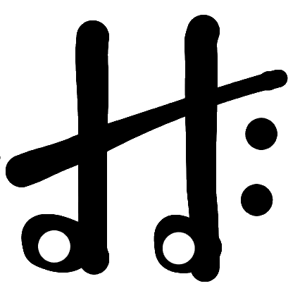

# Harmony

**Reproductor de música local + cliente de YouTube Music en una sola app para Android.**  
Basado en [InnerTune](https://github.com/z-huang/InnerTune) y el ecosistema de [OuterTune](https://github.com/OuterTune/OuterTune).


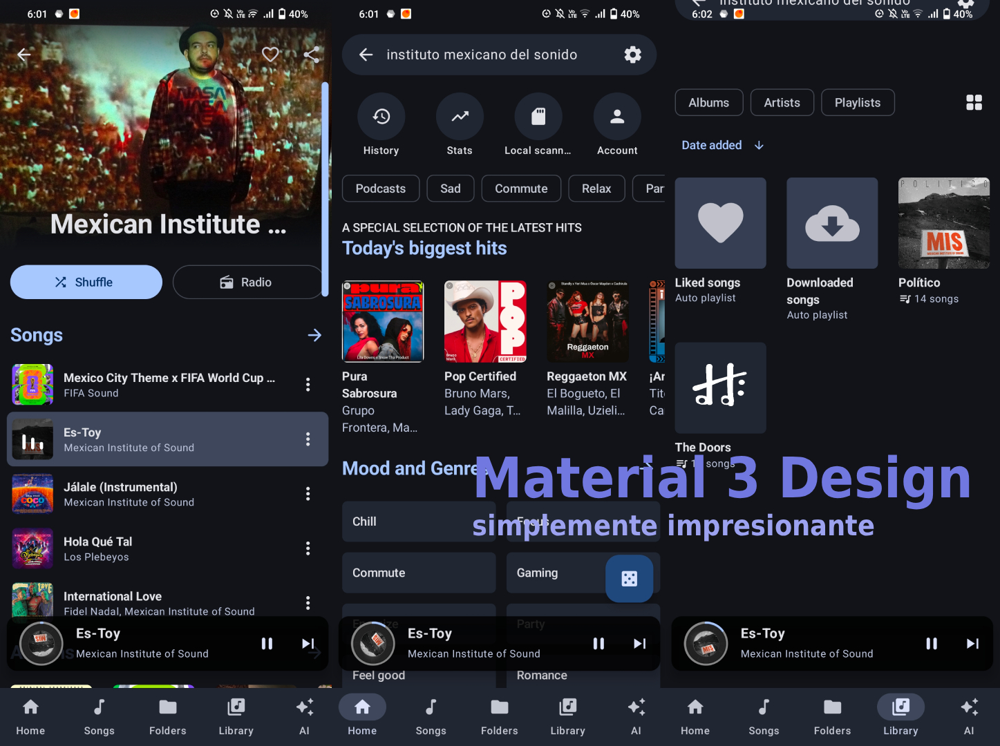

</div>

---

## Galería

<div align="center">

### Móvil

| Player | Homepage | Library |
|:---:|:---:|:---:|
| 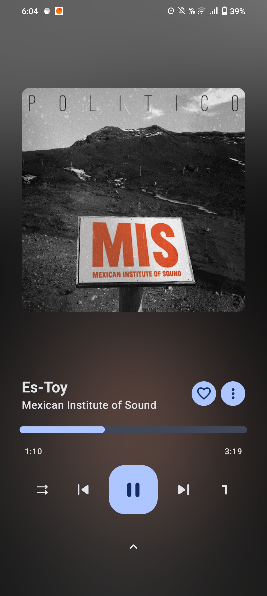 | 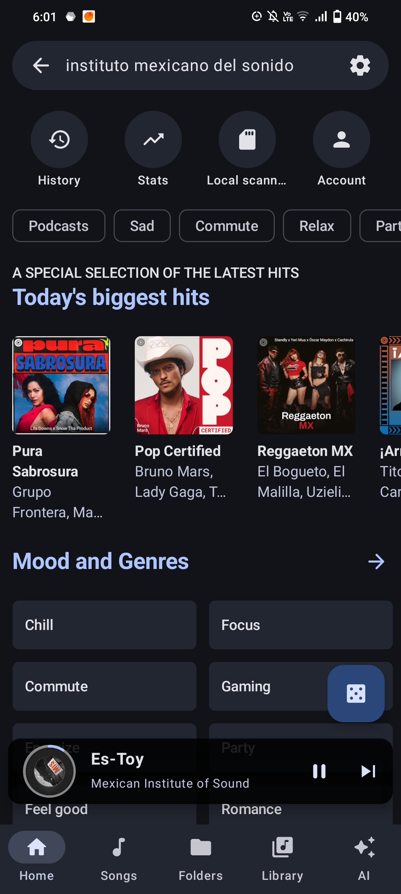 | 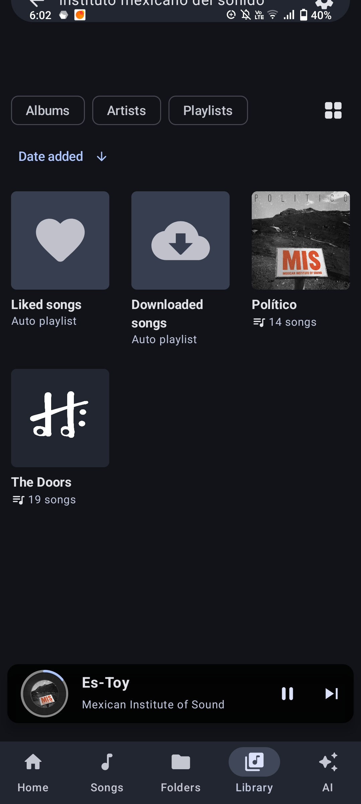 |

| Queue (collapsed) | Queue (expanded) | Library songs |
|:---:|:---:|:---:|
| 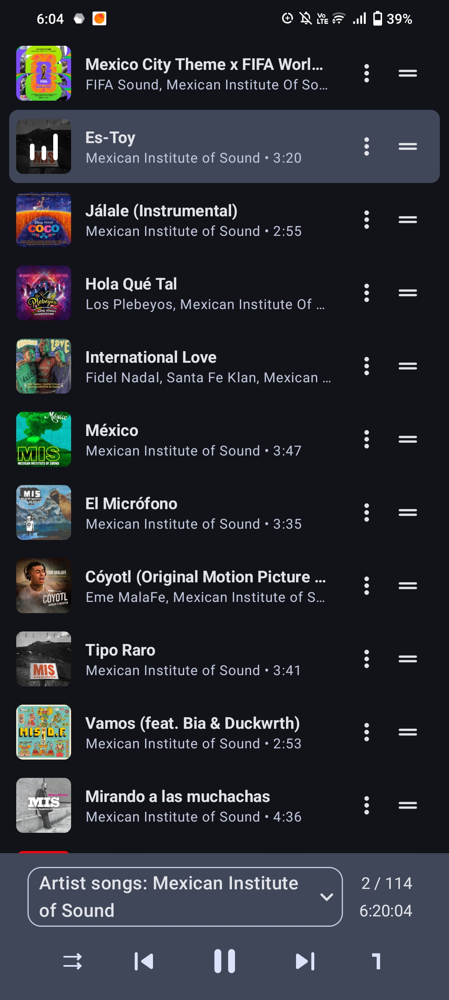 | 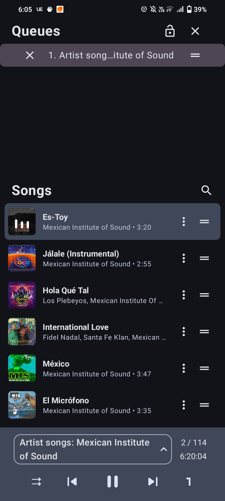 | 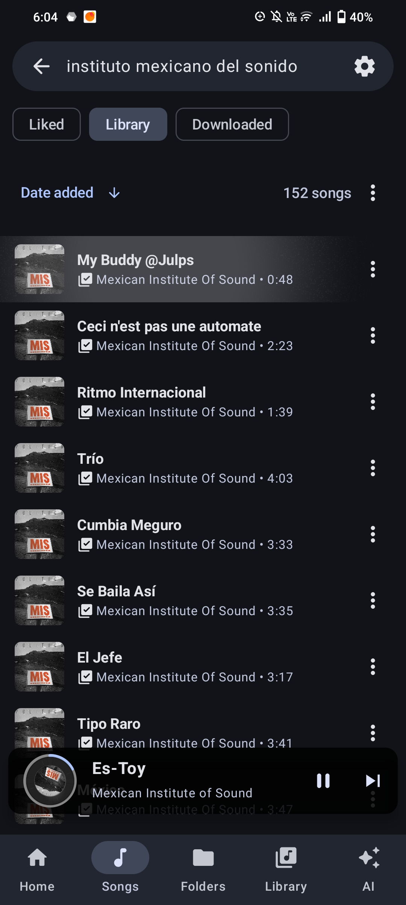 |

| Folders | Artist | Lyrics |
|:---:|:---:|:---:|
| 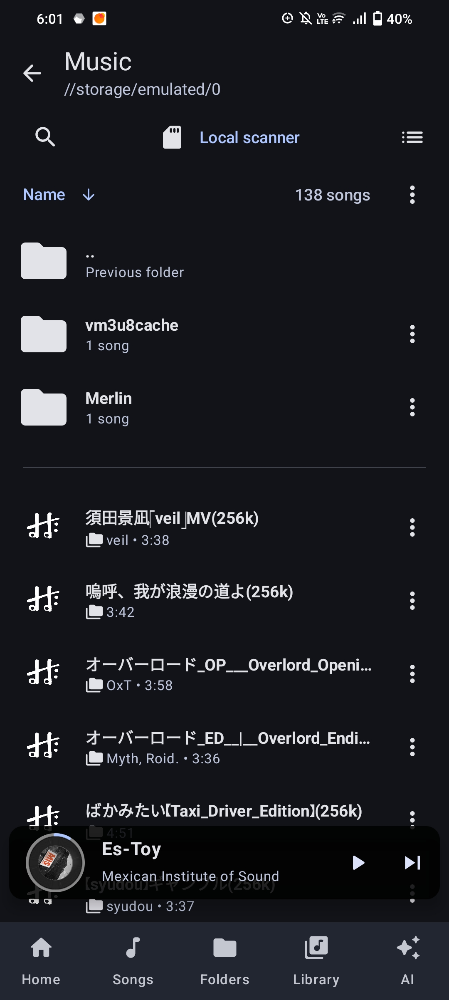 | 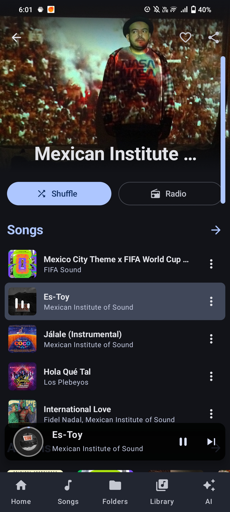 | 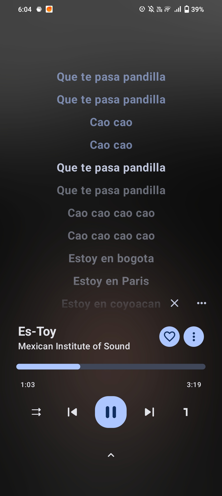 |

| AI Chatbot | Settings |
|:---:|:---:|
| 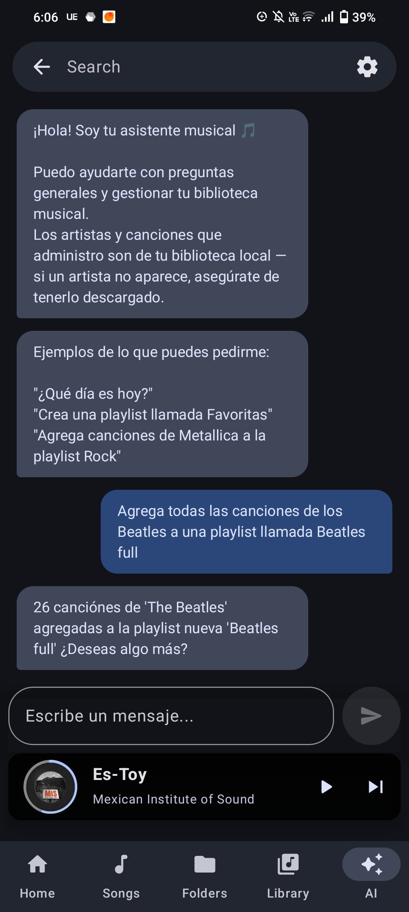 | 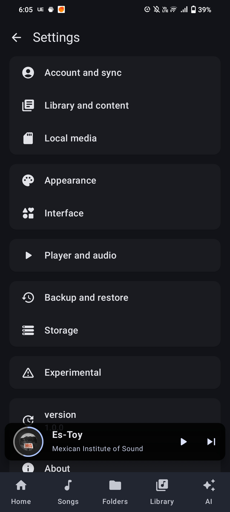 |

### Tablet

| Light | Dark |
|:---:|:---:|
|  |  |

</div>

---

## Características

- 🎵 **Música local** — MP3, FLAC, OGG y más.
- 📺 **YouTube Music** — reproducción en segundo plano y descargas.
- 📚 **Biblioteca unificada** — contenido local y online en una sola vista.
- 🔄 **Sincronización YTM** — vincula tu cuenta de YouTube Music.
- 🎤 **Letras sincronizadas** — LRC / TTML / SRT con modo karaoke palabra por palabra.
- 🎛️ **Múltiples colas de reproducción.**
- 🚗 **Android Auto** — integración nativa.
- 🏷️ **Metadatos mejorados** — TagLib / FFmpeg / MediaStore según configuración.
- 🤖 **Modo AI experimental** — LLM local vía `llama.cpp` (modelo: Qwen2-500m).

---

## Requisitos

| Componente | Versión |
|---|---|
| Android | 8.0+ (minSdk 24) |
| JDK | 21 |
| Android SDK | compileSdk 36 |
| NDK + CMake | requerido (código nativo) |
| Git | con soporte de submódulos |

---

## Instalación

Descarga el APK desde la sección **[Releases](../../releases)** del repositorio.

> La variante `full` incluye el extractor FFmpeg para metadatos avanzados.

---

## Compilación local

### 1. Clonar el repositorio

```bash
git clone --recurse-submodules <URL_DEL_REPOSITORIO>
cd Harmony_OuterTune
```

### 2. Variante `core`

```bash
# Debug
./gradlew assembleCoreDebug

# Lint + tests (igual que CI)
./gradlew lintCoreDebug testCoreDebugUnitTest

# Release
./gradlew assembleCoreRelease
```

### 3. Variante `full` (requiere FFmpeg precompilado)

```bash
git clone https://github.com/mikooomich/ffmpeg-android-maker-prebuilt/ \
  -b audio ffMetadataEx/ffmpeg-android-maker

./gradlew assembleFullDebug
./gradlew assembleFullRelease
```

---

## Variantes

| Variante | Descripción |
|---|---|
| `core` | Build por defecto, más ligero. |
| `full` | Añade extractor FFmpeg y componentes avanzados. |

| Tipo de build | Descripción |
|---|---|
| `debug` | Sin optimizaciones, con logs. |
| `userdebug` | Similar a release pero sin minificación. |
| `release` | Optimizado y minificado. |

---

## Estructura de módulos

| Módulo | Descripción |
|---|---|
| `app` | Aplicación principal: UI (Compose), reproducción, Room, configuración. |
| `innertube` | Cliente/API para YouTube Music. |
| `kugou` | Integración de letras vía KuGou. |
| `lrclib` | Integración de letras vía LrcLib. |
| `ffMetadataEx` | Integración nativa NDK/CMake con FFmpeg para metadatos. |
| `taglib` | Parsing de metadatos de audio (C++ / JNI). |
| `material-color-utilities` | Utilidades de color Material You. |

---

## Tecnologías

`Kotlin` · `Jetpack Compose` · `Media3 / ExoPlayer` · `Room` · `Hilt` · `Ktor` · `NDK / CMake` · `llama.cpp` · `FFmpeg` · `TagLib`

---

## Créditos

Basado en ideas y trabajo de **InnerTune** y el ecosistema de **OuterTune**.

---

## Licencia

Este proyecto se distribuye bajo licencia **GPL-3.0**. Consulta [LICENSE](LICENSE).
