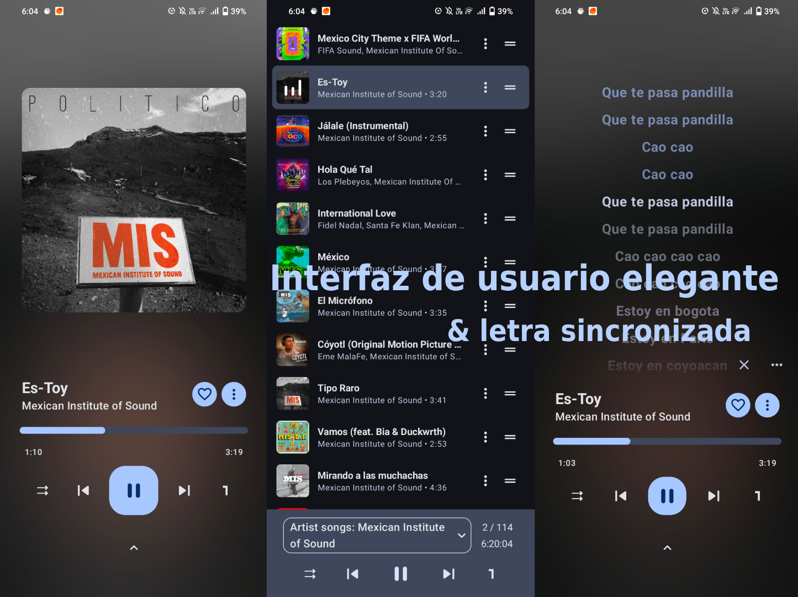

# Harmony

Aplicación de música para Android basada en OuterTune/InnerTune: combina un reproductor local con cliente de YouTube Music en una sola app.


## Galería


## Imágenes adicionales





## Características

- Reproducción de música local (MP3, FLAC, OGG, etc.)
- Cliente de YouTube Music con reproducción en segundo plano y descargas
- Biblioteca unificada (contenido local + online)
- Sincronización con cuenta de YouTube Music
- Letras sincronizadas (LRC/TTML/SRT), incluyendo modo karaoke palabra por palabra
- Múltiples colas de reproducción
- Integración con Android Auto
- Extracción de metadatos mejorada (TagLib/FFmpeg/MediaStore según configuración)
- Modo `AI` experimental en la app (LLM local vía `llama.cpp`modelo: Qwen2-500m)

## Requisitos

- Android `8.0+` (minSdk 24)
- JDK `21`
- Android SDK con `compileSdk 36`
- NDK y CMake (el proyecto usa código nativo)
- Git con submódulos

## Instalación (usuarios)

- Descarga un APK desde la sección **Releases** del repositorio.
- Si usas la variante `full`, incluye componentes adicionales como extractor FFmpeg para metadatos.

## Compilación local (desarrolladores)

1. Clonar el repo con submódulos:

```bash
git clone --recurse-submodules <URL_DEL_REPOSITORIO>
cd Hamony_OuterTune
```

2. Compilar variante `core` debug:

```bash
./gradlew assembleCoreDebug
```

3. Ejecutar lint y tests de JVM (igual que CI):

```bash
./gradlew lintCoreDebug testCoreDebugUnitTest
```

4. Compilar release `core`:

```bash
./gradlew assembleCoreRelease
```

### Compilar variante `full`

La variante `full` requiere librerías FFmpeg precompiladas dentro de `ffMetadataEx/ffmpeg-android-maker`.

```bash
git clone https://github.com/mikooomich/ffmpeg-android-maker-prebuilt/ -b audio ffMetadataEx/ffmpeg-android-maker
./gradlew assembleFullDebug
# o release
./gradlew assembleFullRelease
```

## Variantes del proyecto

- `core`: build por defecto, más ligera
- `full`: añade componentes avanzados (por ejemplo, extractor FFmpeg)

También existen tipos de build:

- `debug`
- `userdebug` (similar a release, sin minificación)
- `release`

## Estructura de módulos

- `app`: aplicación principal Android (UI, reproducción, base de datos, configuración)
- `innertube`: cliente/API para YouTube Music
- `kugou`: integración de letras (KuGou)
- `lrclib`: integración de letras (LrcLib)
- `ffMetadataEx`: integración nativa con FFmpeg para metadatos
- `taglib`: parsing/lectura de metadatos de audio
- `material-color-utilities`: utilidades de color Material

## Tecnologías

- Kotlin + Jetpack Compose
- Media3 (ExoPlayer, Session, Download)
- Room
- Hilt
- Ktor
- NDK/CMake (C++)

## Créditos

- Basado en ideas y trabajo de **InnerTune** y el ecosistema de **OuterTune**.

## Licencia

Este proyecto se distribuye bajo licencia **GPL-3.0**. Consulta [LICENSE](LICENSE).
